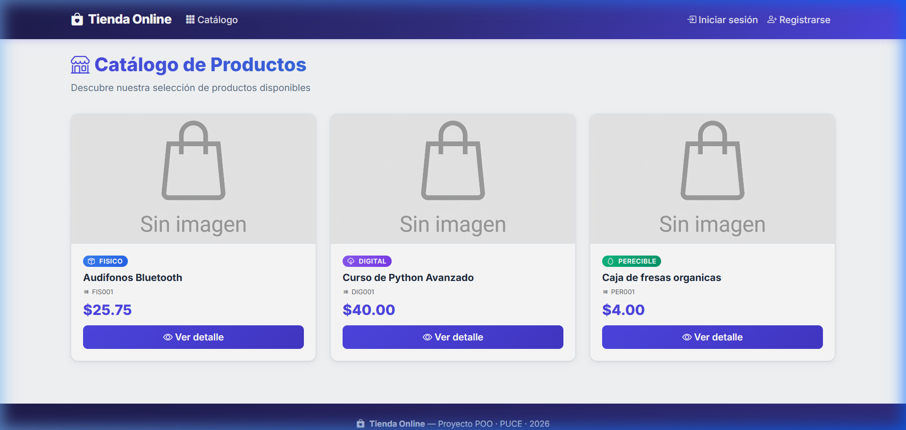
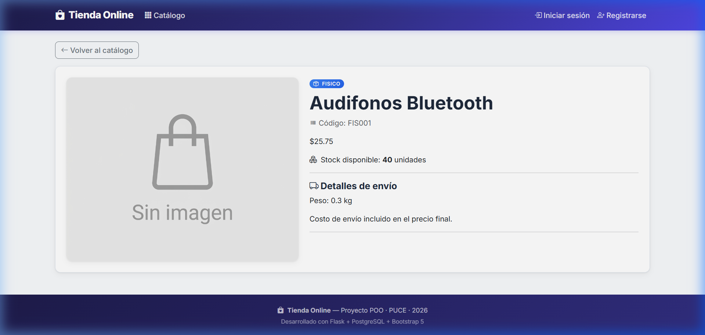
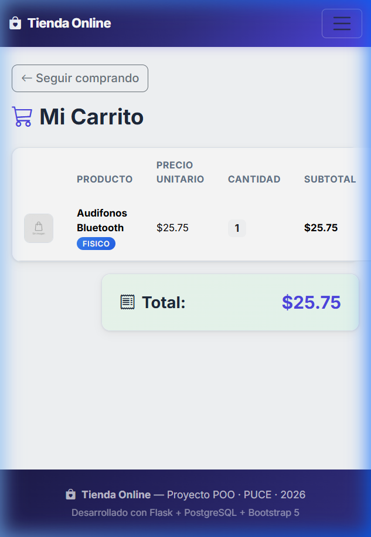

# 🛒 Tienda Online — Proyecto POO

Aplicación web de tienda online desarrollada con **Flask** y **PostgreSQL**, como parte del curso de **Programación Orientada a Objetos (POO)** en la **PUCE**.

La aplicación implementa un catálogo de productos con herencia de clases (Producto base → ProductoFísico, ProductoDigital, ProductoPerecible), sistema de autenticación con roles, carrito de compras, subida de imágenes y un diseño responsive.

---

## 📋 Características

- **Catálogo de productos** con 3 tipos: Físico, Digital y Perecible.
- **Herencia/POO**: clases con `precio_final()` que calcula el precio según el tipo de producto.
- **CRUD completo**: crear, ver, editar y desactivar productos (solo admin).
- **Autenticación**: registro e inicio de sesión con contraseñas encriptadas.
- **Roles**: admin (gestiona productos) y cliente (compra).
- **Carrito de compras** con sesiones.
- **Subida de imágenes** de productos.
- **Diseño responsive** con Bootstrap 5 y CSS personalizado.

---

## ⚙️ Instrucciones de Instalación y Ejecución

### Requisitos previos
- Python 3.10+
- PostgreSQL instalado y corriendo

### Pasos

1. **Clonar el repositorio:**
   ```bash
   git clone https://github.com/dalton-isaac/tienda_online.git
   cd tienda_online
   ```

2. **Crear y activar el entorno virtual:**
   ```bash
   python -m venv venv
   # Windows:
   venv\Scripts\activate
   # Mac/Linux:
   source venv/bin/activate
   ```

3. **Instalar dependencias:**
   ```bash
   pip install flask flask-sqlalchemy psycopg2-binary python-dotenv
   ```

4. **Crear la base de datos en PostgreSQL:**
   ```sql
   CREATE DATABASE tienda_online;
   ```

5. **Configurar variables de entorno:** Crear un archivo `.env` en la raíz del proyecto:
   ```
   DB_USER=postgres
   DB_PASSWORD=tu_contraseña
   DB_HOST=localhost
   DB_PORT=5432
   DB_NAME=tienda_online
   SECRET_KEY=una-clave-secreta-segura
   ```

6. **Inicializar la base de datos con datos de prueba:**
   ```bash
   python init_db.py
   ```

7. **Ejecutar la aplicación:**
   ```bash
   python app.py
   ```

8. **Abrir en el navegador:** [http://localhost:5000](http://localhost:5000)

---

## 🔐 Credenciales de Prueba

| Rol     | Correo              | Contraseña  |
|---------|---------------------|-------------|
| Admin   | admin@tienda.com    | admin123    |
| Cliente | cliente@tienda.com  | cliente123  |

- **Admin**: puede crear, editar y desactivar productos.
- **Cliente**: puede navegar el catálogo, ver detalles y usar el carrito de compras.

---

## 📸 Capturas de Pantalla

### Catálogo de Productos


### Detalle de Producto


### Carrito de Compras


---

## 🛠️ Tecnologías Utilizadas

- **Backend**: Flask (Python)
- **Base de datos**: PostgreSQL + SQLAlchemy
- **Frontend**: HTML5, Bootstrap 5, CSS personalizado
- **Iconos**: Bootstrap Icons
- **Fuente**: Google Fonts (Inter)

---

## 📁 Estructura del Proyecto

```
tienda_online/
├── app.py              # Punto de entrada, rutas de la aplicación
├── models.py           # Modelos de datos (Producto, Usuario, herencia)
├── config.py           # Configuración (DB, uploads)
├── auth.py             # Decoradores de autenticación y roles
├── init_db.py          # Script para inicializar la BD con datos de prueba
├── .gitignore          # Archivos excluidos del repositorio
├── README.md           # Este archivo
├── static/
│   ├── css/
│   │   └── custom.css  # Estilos personalizados
│   ├── img/
│   │   └── default.jpg # Imagen por defecto de productos
│   └── uploads/        # Imágenes subidas por el admin
└── templates/
    ├── base.html       # Plantilla base (navbar, footer)
    ├── index.html      # Catálogo de productos
    ├── detalle.html    # Detalle de un producto
    ├── editar.html     # Formulario de edición
    ├── nuevo_fisico.html
    ├── nuevo_digital.html
    ├── nuevo_perecible.html
    ├── carrito.html    # Carrito de compras
    ├── login.html      # Inicio de sesión
    └── registro.html   # Registro de usuario
```
